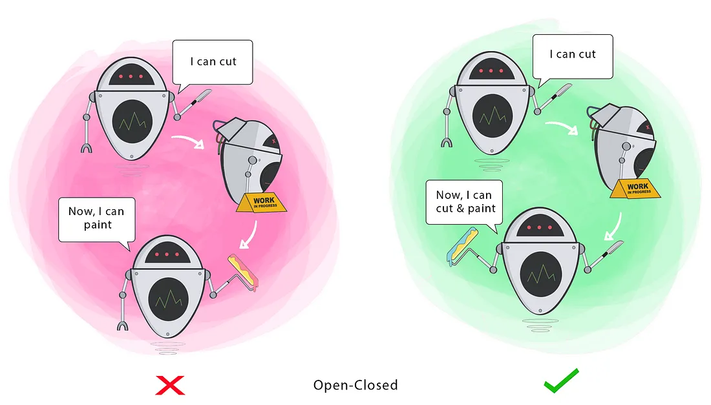
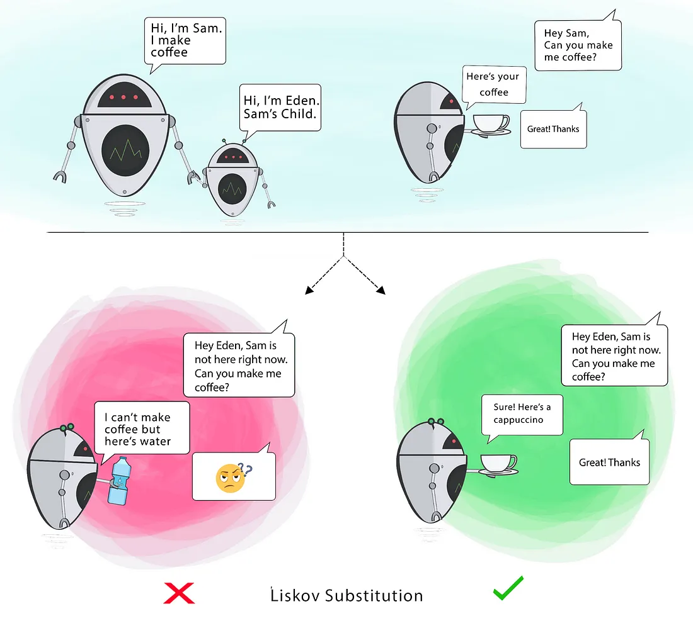

# SOLID_Principles

Table of contents: 
----------------------
- [**Concept**](https://github.com/ahmed4649080/SOLID_Principles#concept)
- [**SOLID Principles**](https://github.com/ahmed4649080/SOLID_Principles#solid-principles)

# Concept: 
SOLID is an acronym that represents a set of five principles of object-oriented design that aim to improve code quality, making it easier to maintain and extend. The five principles are Single Responsibility Principle, Open-Closed Principle, Liskov Substitution Principle, Interface Segregation Principle, Dependency Inversion Principle. 

# SOLID Principles: 

Single Responsibility Principle: 
----------------------
A class should have only one responsibility. This means that each class should have only one reason to change and only one task or responsibility within the system.

Open-Closed Principle: 
----------------------
A class should be open for extension but closed for modification. This means that the behavior of the class can be extended without modifying its original source code.

Liskov Substitution Principle: 
----------------------
Subtypes should be substitutable for their base types. This means that derived classes should be able to be used anywhere their base classes are used.

Interface Segregation Principle: 
----------------------
A class should not be forced to implement interfaces and methods that are not used. This means that interfaces should be specific and cohesive, and classes should implement only the methods necessary for their operation.

Dependency Inversion Principle: 
----------------------
High-level modules should not depend on low-level modules, both should depend on abstractions.

